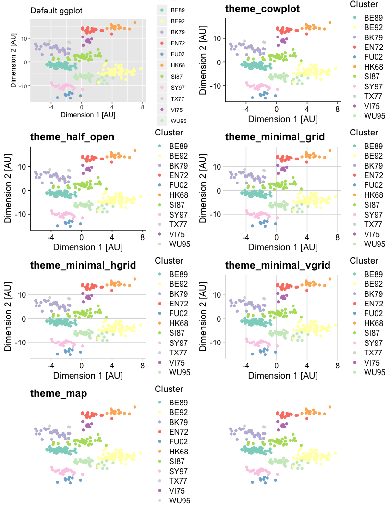

```{r setup, include=FALSE}
knitr::opts_chunk$set(echo = TRUE,
                      cache = TRUE,
                      fig.align = "center",
                      out.height = "80%")
```

# Background: cowplot
* `cowplot`: short for **C**laus **O**. **W**ilkes plot package, initially
 developed for Claus's lab members
 
* add on to `ggplot2`

`cowplot` is described as

    provid[ing] various features that help with creating publication-
    quality figures, such as a set of themes, functions to align plots and
    arrange them into complex compound figures, and functions that make it easy
    to annotate plots and or mix plots with images.


# Loading libraries

```{r}
library("readr")
library("ggplot2")
library("cowplot")
library("RColorBrewer")
```


# Set up data and plot

* read antigenic cartography data from @Smith2004

```{r}
coord <- read_csv("data/2004_Science_Smith_data.csv")
```

* Initiate `ggplot2` object

```{r}
p <- ggplot(data=coord)
```


# Individual visualisations

* recreate plots from "R bootcamp - part 2: visualisation with
ggplot2" 
* save them in individual `ggplot2` objects

```{r}
antigenic_map <- p + 
  geom_point(aes(x=x.coordinate, y=y.coordinate, color=cluster)) +
  scale_color_brewer(type="qual", palette = "Set3") +
  labs(x="Dimension 1 [AU]",
       y="Dimension 2 [AU]",
       color="Cluster") +
  theme_bw()

time_barplot <- p + geom_bar(aes(x=year, fill=cluster),
                             position=position_dodge(preserve="single")) +
  scale_fill_brewer(type="qual", palette = "Set3") +
  labs(x="Count",
       y="Year",
       fill="Cluster") +
  theme_bw()

time_boxplot <- p + 
  geom_boxplot(aes(x=type, y=year, color=type)) +
  geom_jitter(aes(x=type, y=year, color=type)) +
  scale_color_manual(values=c("#66c2a5", "#fc8d62")) +
  labs(x="Type",
       y="Time",
       color="Type") +
  theme_bw()
```

# Simple compound plots

```{r}
plot_grid(time_barplot, time_boxplot)
```

# Customising `plot_grid`: Labels
* specifying the desired labels in a vector 
    * reminder: vectors are created with `c()`, by providing its elements
    separated by commons, e.g. `c(1.6, 2.5, 3.2)` is a vector with three
    elements of the type double.
    * labels have to be provided for all or none of the panels i.e. the length
    of the vector has to be the same as number of panels
    * to label only certain panels make use of the empty string: `""` e.g.
    `c("a", "")` will label first panel with a, second panel with nothing
    
* auto-generate labels with:
  * `labels="AUTO"` for upper-case labels
  * `labels="auto"` for lower-case labels.

```{r}
plot_grid(time_barplot, time_boxplot,
          labels=c(1,2))

```

# Customising `plot_grid`: Layout

Specify layout with the number of colums `ncol` or number or rows `nrow`:

```{r, fig.height=7}
plot_grid(time_barplot, time_boxplot,
          labels=c(1,2),
          nrow=2)
```

# Customising `plot_grid`: Alignment

* `plot_grid` default: *axis titles* alignement
* To align by *actual axis*: use combination of the `align` and `axis`

```{r, fig.height=7}
plot_grid(time_barplot, time_boxplot,
          labels=c(1,2),
          nrow=2,
          align="v",
          axis="lr")
```

# Exercises: simple compound plots

1. Autogenerate lower-case labels for the compound plot of `time_boxplot` and 
`time_barplot`.
2. Change the default layout by specifying the number of columns. 
3. Read the help function for `plot_grid` and experiment with other `axis`
options.


# Exercises: simple compound plots

1. Autogenerate lower-case labels for the compound plot of `time_boxplot` and 
`time_barplot`.

```{r}
plot_grid(time_boxplot, time_barplot,
          labels="auto",
          nrow=2,
          align="v",
          axis="lr")
```

# Exercises: simple compound plots

2. Change the default layout by specifying the number of columns. 

```{r}
plot_grid(time_boxplot, time_barplot,
          labels="auto",
          ncol=1,
          align="v",
          axis="lr")
```

# Exercises: simple compound plots

3. Read the help function for `plot_grid` and experiment with other `axis`
options

```{r, eval=FALSE}
?plot_grid
```


    align	  (optional) Specifies whether graphs in the grid should be
              horizontally ("h") or vertically ("v") aligned. Options are "none"
              (default), "hv" (align in both directions), "h", and "v".

    axis      (optional) Specifies whether graphs should be aligned by the left
              ("l"), right ("r"), top ("t"), or bottom ("b") margins. Options
              are "none" (default), or a string of any combination of l, r, t,
              and b in any order (e.g. "tblr" or "rlbt" for aligning all
              margins).

# Compound plots with more than two panels

```{r, fig.height=7}
plot_grid(time_barplot, time_boxplot, antigenic_map)
```
This layout does not look great, for several reason:

1. We have a void in the lower right corner;
1. The heights of both rows are the same, which unnessecarily stretches the 
bar and boxplot.

# Nested compound plots

1. Generate composite for the right-hand column with `time_barplot` and
   `time_boxplot`;
2. Combine with the antigenic map.

```{r, fig.asp = 1}
right_column <- plot_grid(time_boxplot, time_barplot,
                   nrow=2,
                   align="v",
                   axis="lr")

plot_grid(antigenic_map, right_column,
          nrow=1,
          align="h",
          axis="t")
```

# Shared legends in compound plots

* remove the individual legends;
* shared legend as an additional row to `plot_grid`

```{r, fig.asp = 1, echo=FALSE}
right_column <- plot_grid( time_boxplot + theme(legend.position = "bottom"),
                           time_barplot + theme(legend.position = "none"),
                           nrow=2,
                           align="v",
                           axis="lr")

top_row <- plot_grid(antigenic_map + theme(legend.position = "none"),
                     right_column, nrow=1)

new_map <- antigenic_map +
  guides(color=guide_legend(nrow=2)) +
  theme(legend.position = "bottom")

cluster_legend <- get_legend(new_map)

plot_grid(top_row, cluster_legend,
          nrow=2,
          rel_heights = c(10,1))

```

# Shared legends, step 1: create individual panel components

* Add `legend.position` via `theme`:

  * boxplot legend below plot with `theme(legend.position = "bottom")`;
  * barplot and anitgentic map legend removed with
   `theme(legend.position = "none")`.

**Note**: We only move and remove the legends from the objects that we pass to
`plot_grid`, the original objects remain unchanged.


```{r, fig.asp = 1}
right_column <- plot_grid( time_boxplot + theme(legend.position = "bottom"),
                           time_barplot + theme(legend.position = "none"),
                           nrow=2,
                           align="v",
                           axis="lr")

top_row <- plot_grid(antigenic_map + theme(legend.position = "none"),
                     right_column, nrow=1)
```

# Shared legends, step 2: extract common legend

* Create object with desired design of common legend:
  
  * legend at bottom of plot with `theme(legend.position = "bottom")`;
  * legend with two row layout with `guides(color=guide_legend(nrow=2))`.

* Extract the legend from the `new_map` object with `get_legend`:

```{r, fig.asp = 1}
new_map <- antigenic_map +
  guides(color=guide_legend(nrow=2)) +
  theme(legend.position = "bottom")

cluster_legend <- get_legend(new_map)
```

# Shared legends, step 3: combine panels and common legend

* combine components in a new call to `plot_grid`;
* specify `rel_heights` for ratio of compound panel to shared legend height.

```{r, fig.asp = 1}
plot_grid(top_row, cluster_legend,
          nrow=2,
          rel_heights = c(10,1))

```

# Exercises: shared legends
1. What would be a good labeling strategy for this nested plot? Label
accordingly.
2. Play with the ratios provided to `rel_heights`. Why does it not make sense to
provide `rel_widths` in this example? 

# Exercises: shared legends

1. What would be a good labeling strategy for this nested plot? Label
accordingly.

```{r, fig.asp = 1}
right_column <- plot_grid( time_boxplot + theme(legend.position = "bottom"),
                           time_barplot + theme(legend.position = "none"),
                           nrow=2,
                           align="v",
                           axis="lr",
                           labels=c("b", "c"))

top_row <- plot_grid(antigenic_map + theme(legend.position = "none"),
                     right_column, nrow=1,
                     labels=c("a", ""))

plot_grid(top_row, cluster_legend,
          nrow=2,
          rel_heights = c(10,1))
```

# Exercises: shared legends

2. Play with the ratios provided to `rel_heights`. Why does it not make sense to
provide `rel_widths` in this example? 

```{r, fig.asp = 1}
plot_grid(top_row, cluster_legend,
          nrow=2,
          rel_heights = c(4,1))
```

`rel_widths` only useful when putting panels in multiple columns, not multiple
rows.

# `cowplot` themes

```{r, fig.asp = 2.5, eval=FALSE}
plot_grid(antigenic_map + theme_gray() + ggtitle("Default ggplot"),
          antigenic_map + theme_cowplot()  + ggtitle("theme_cowplot"),
          antigenic_map + theme_half_open()  + ggtitle("theme_half_open"), 
          antigenic_map + theme_minimal_grid() + ggtitle("theme_minimal_grid"),
          antigenic_map + theme_minimal_hgrid() + ggtitle("theme_minimal_hgrid"),
          antigenic_map + theme_minimal_vgrid() + ggtitle("theme_minimal_vgrid"),
          antigenic_map + theme_map() + ggtitle("theme_map"),
          antigenic_map + theme_nothing() + ggtitle("theme_nothing"),
          nrow=4,
          align="vh",
          axis="tblr")
```

```{r, echo=FALSE}

```

The lower right plot shows `theme_nothing` by `cowplot`.

**Note**:
Not all themes are equally well suited for each plot type. The `ggplot2` default
for boxplots chooses a simply horizontal grid for instance, where as the same
theme applied to the scatter plot display horizontal and vertical grids.

# Exercises: `cowplot` themes

1. Discuss which other plot type might benefit from a simpler grid than the
default one chosen?
2. What happens if you add a theme to `plot_grid`?
3. Apply different themes to the three individual plots and visualise in
`plot_grid`.

# Exercises: `cowplot` themes

1. Discuss which other plot type might benefit from a simpler grid than the
default one chosen?

Barplot with horizontal lines, similar as in boxplot

# Exercises: `cowplot` themes

2. What happens if you add a theme to `plot_grid`?

```{r, fig.asp = 1}
plot_grid(top_row, cluster_legend,
          nrow=2,
          rel_heights = c(10,1)) +
  theme_cowplot()
```

# Exercises: `cowplot` themes

3. Apply different themes to the three individual plots and visualise in
`plot_grid`.

```{r, fig.asp = 1}
boxplot_new <- time_boxplot +
  theme_cowplot() +
  theme(legend.position = "bottom")

barplot_new <- time_barplot + 
  theme_minimal_hgrid() +
  theme(legend.position = "none")

map_new <- antigenic_map + 
  theme_half_open() +
  theme(legend.position = "none")

right_column <- plot_grid(boxplot_new,
                          barplot_new,
                          nrow=2,
                          align="v",
                          axis="lr",
                          labels=c("b", "c"))

top_row <- plot_grid(map_new,
                     right_column, nrow=1,
                     labels=c("a", ""))

plot_grid(top_row, cluster_legend,
          nrow=2,
          rel_heights = c(10,1))
```


# Additional material
The `ggpubr` package provides some easy-to-use functions for creating and
customizing `ggplot2`- based publication ready plots:
[ggplot2 Based Publication Ready Plots](https://rpkgs.datanovia.com/ggpubr/)

<div class="row" style="padding: 25px 50px 75px 50px"></div>
<div class="row" style="padding: 25px 50px 75px 50px">
  <div class="col-lg-4">
```{r, echo=FALSE}
knitr::include_graphics("images/ggpubr-example.png")
```
  </div>
  <div class="col-lg-4">
```{r, echo=FALSE}
knitr::include_graphics("images/ggpubr-example-lollipop.png")
```
  </div>
  <div class="col-lg-4">
```{r, echo=FALSE}
knitr::include_graphics("images/ggpubr-example-bars.png")
```
  </div>
</div>

# References
Cowplot documentation on this webpage:
[cowplot](https://wilkelab.org/cowplot/index.html)
