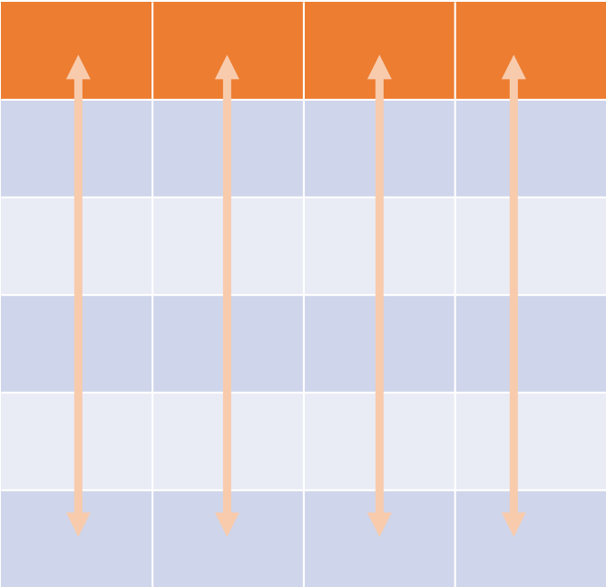
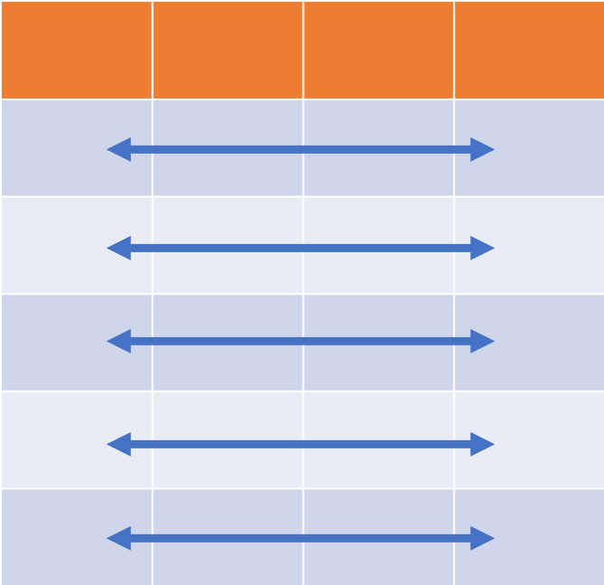
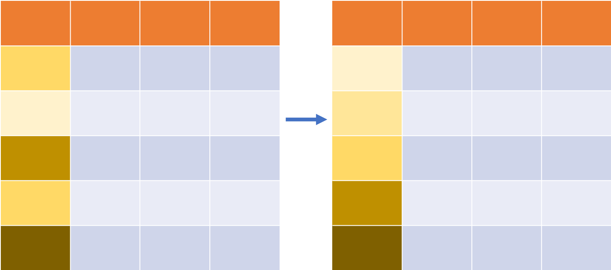
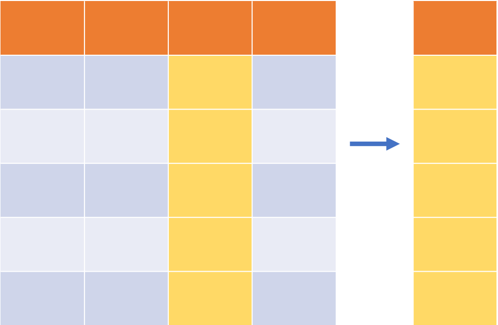
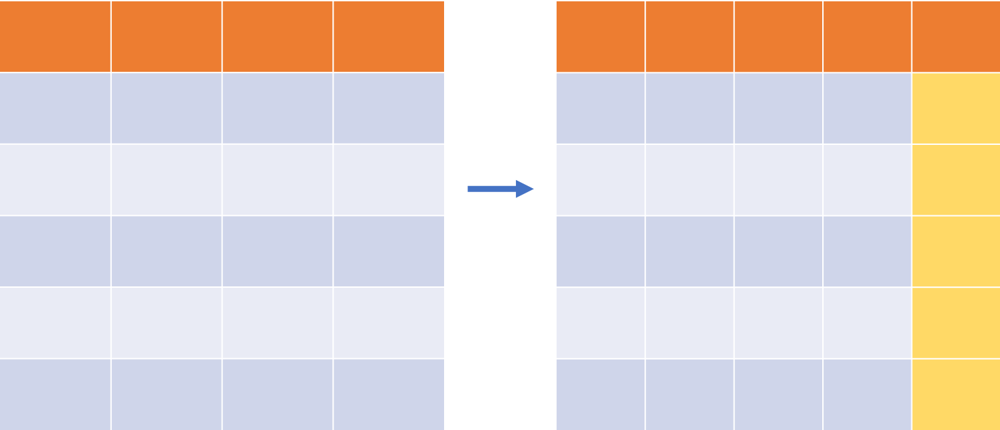
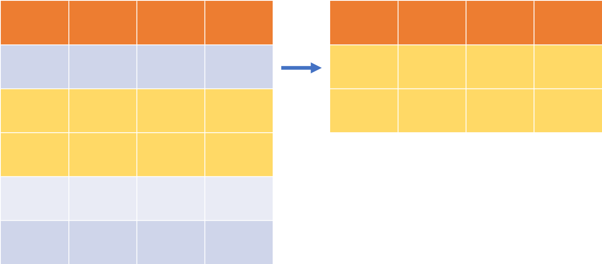
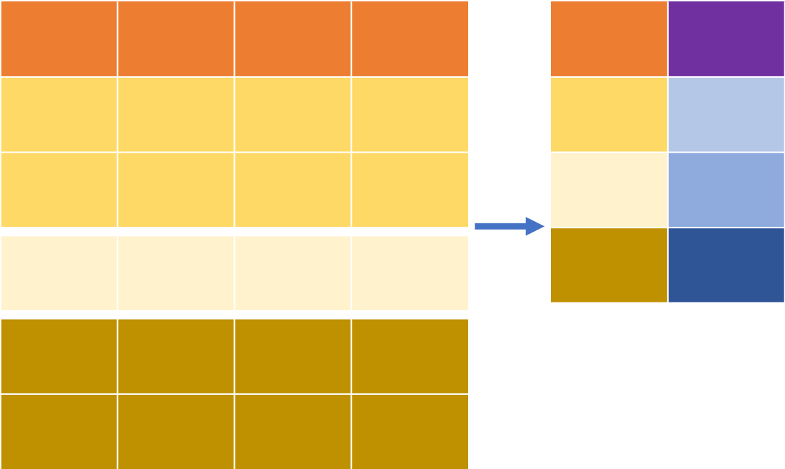
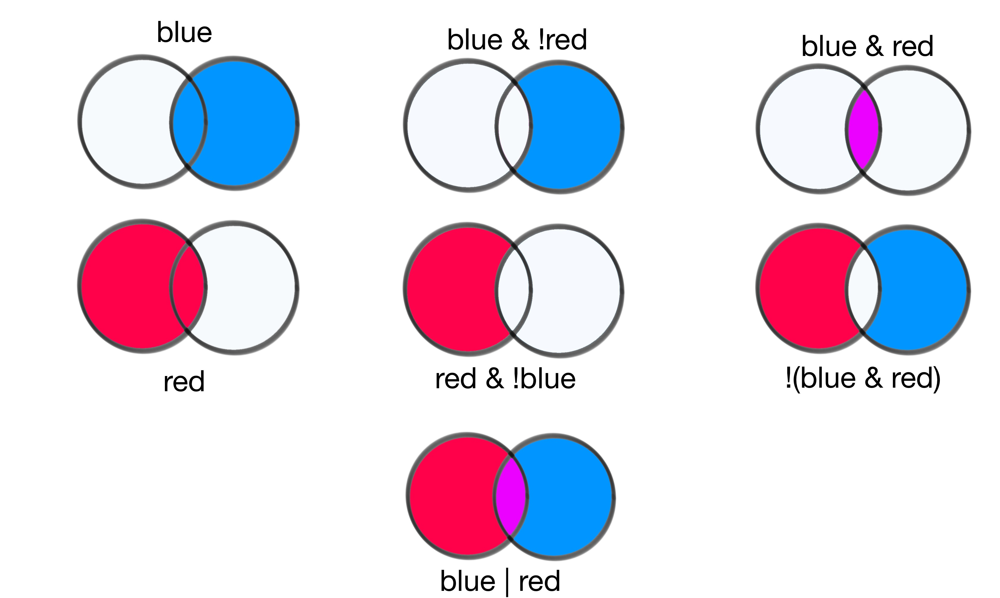

```{r setup, include=FALSE}
knitr::opts_chunk$set(echo = TRUE,
                      cache = TRUE,
                      fig.align = "center",
                      out.height = "80%")
```

# Why a course on data manipulation?

* **Data analysis and visualisation**:
  * easy part (often at least): visualise data/results
  * hard part (most the time): cleaning, formating, sanity checks
  
* **Objective of this course**:
learn `dplyr` and the 'tidy' format for visualisation and analysis.

```{r, echo=FALSE, fig.cap="Adopted from Jeff Griesemer (2019)"}
knitr::include_graphics("images/dplyr.png")
```

* more data wrangling and additional examples in Hadley Wickham book
'R for Data Science' [@Wickham2017].
* overview and help on `dplyr` functions on cheat sheet (*Help* > *Cheatsheets*
 > *Data Transformation with `dplyr`*)

# Set-up

* load the required libraries
```{r libraries, message=FALSE}
library("readr")
library("dplyr")
```

* read data

```{r paths}
coord <- read_csv("data/2004_Science_Smith_data.csv")
```
# Object types

The tidyverse uses data in the **long format**:
<div class="row" style="padding: 25px 50px 75px 50px">
  <div class="col-lg-2"></div>
  <div class="col-lg-4">
```{r, echo=FALSE,  fig.cap="Variables"}

```
  </div>
  <div class="col-lg-4">
```{r, echo=FALSE, fig.cap="Observations"}

```
  </div>
  <div class="col-lg-2"></div>
</div>
<div class="row" style="padding: 25px 50px 75px 50px">
```{r, echo=FALSE}
head(coord)
```
</div>

# dplyr: a grammar of data manipulation

* member of the `tidyverse`
* core functionality:

<div class="row" style="padding: 25px 50px 75px 50px"></div>
<div class="row" style="padding: 25px 50px 75px 50px">
  <div class="col-lg-4">
```{r, echo=FALSE, fig.cap="arrange()", out.width = '50%'}

```
  </div>
  <div class="col-lg-4">
```{r, echo=FALSE, fig.cap="select()", out.width = '50%'}

```
  </div>
  <div class="col-lg-4">
```{r, echo=FALSE, fig.cap="mutate()", out.width = '50%'}

```
  </div>
</div>
<div class="row" style="padding: 25px 50px 75px 50px">
  <div class="col-lg-4">
```{r, echo=FALSE, fig.cap="filter()", out.width = '50%'}

```
  </div>
  <div class="col-lg-4">
```{r, echo=FALSE, fig.cap="group_by()", out.width = '50%'}
knitr::include_graphics("images/dplyr-group_by.png")
```
  </div>
  <div class="col-lg-4">
```{r, echo=FALSE, fig.cap="summarise()", out.width = '50%'}

```
  </div>
</div>

# How `dplyr` verbs work

* first argument is a `tibble` or `data.frame`;
* subsequent arguments describe the action to apply to that 
  `tibble`/`data.frame` by specifying the variable names
* result is a new `tibble`/`data.frame`, dependent on the initial input

**Note**: results of a `dplyr` function have to be assigned to new object via
the assignment operator `<-`


#  Change the order of observations with `arrange()`
<div class="row" style="padding: 25px 50px 75px 50px">
  <center>
```{r, echo=FALSE, fig.cap="arrange()", out.width = '50%'}

```
  </center>
</div>
  
* `arrange` takes a `tibble` and a set of variable names
* re-arrange observations based on variable selected for re-ordering. 

**Example**: order `coord` by location and year:
```{r}
arrange(coord, location, year)
```

#  Change the order of observations in descending order

* `arrange` orders the variables in ascending order
* re-order in descending order with `desc()`:

```{r}
arrange(coord, desc(location), year)
```
# Exercises
1. How does the ouput change if you sorted by year first, then location?
2. Sort `coord` to find when the last virus was isolated.
3. Find the largest and smallest x.coordinate in the dataset.

# Exercises

1. How does the ouput change if you sorted by year first, then location?

```{r}
arrange(coord, year, location)
```


# Exercises

2. Sort `coord` to find when the last virus was isolated.

```{r}
arrange(coord, desc(year))
```


# Exercises

3. Find the largest and smallest x.coordinate in the dataset.
```{r}
arrange(coord, desc(x.coordinate))
arrange(coord, x.coordinate)
```


# Select a subset of variables with `select()`

<div class="row" style="padding: 25px 50px 75px 50px">
  <center>
```{r, echo=FALSE, fig.cap="select()", out.width = '40%'}

```
  </center>
</div>

* `select()` a subset of variables
* specify the `tibble` (first argument) followed by variables to select

**Example**: select only name and location:

```{r}
select(coord, name, location)
```

# Exclude a subset of variables with `select()`

* use `select()` with the variable name preceded by a minus `-`:

```{r}
select(coord, -type)
```

# `select` functions to select multiple variables with common elements

* `starts_with("year")`: matches names that begin with “year”.
* `ends_with("coordinate")`: matches names that end with “coordinate”.
* `contains("coord")`: matches names that contain “coord”.
* `num_range("X", 1:3)`: matches X1, X2 and X3.
* `everything()`: matches everything that has not specifically been named
  before.

**Example**: select all columns that end with the word 'coordinate':

```{r}
select(coord, ends_with("coordinate"))
```

# Exercises
1. What are two other ways of only selecting the `x.coordinate` and
`y.coordinate` columns?
2. Can you use `select` to move the `year` variable from second column to
last?

# Exercises

1. What are two other ways of only selecting the `x.coordinate` and
`y.coordinate` columns?

```{r}
select(coord, x.coordinate, y.coordinate)
```

```{r}
select(coord, contains("coordinate"))
```


# Exercises

2. Can you use `select` to move the `year` variable from second column to
last?

```{r}
select(coord, name, cluster, type, x.coordinate, y.coordinate, location, lat,
       lng, year)
```


# Add new variables with `mutate()`

<div class="row" style="padding: 25px 50px 75px 50px">
  <center>
```{r, echo=FALSE, fig.cap="mutate()", out.width = '50%'}

```
  </center>
</div>

* first argument:  name of the `tibble` to which we want to add a variable
* subsequent argument:
    * name of the new variable
    * an equal sign `=` 
    * and the data to add. 

**Example**: create a new variable, that contains the Euclidean
distance of each antigen from the origin at (0,0):
```{r}
mutate(coord, distance=sqrt(x.coordinate^2 + y.coordinate^2))
```

**Note**: `mutate()` adds the column at the end of the `tibble`; if you want it
at a different position use `select` to reorder the variables afterwards.

# Exercises
1. Add a new column that contains the time difference between this year, 2020,
and the year the virus was isolated.
2. Save the result of this `mutate` in a new object.
3. Move the new column between the `year` and `cluster` columns.


# Exercises

1. Add a new column that contains the time difference between this year, 2020,
and the year the virus was isolated.

```{r}
mutate(coord, difference=2020-year)
```

# Exercises

2. Save the result of this `mutate` in a new object.

```{r}
coord_new <- mutate(coord, difference=2020-year)
```

# Exercises

3. Move the new column between the `year` and `cluster` columns.

a) by naming all variables:

```{r}
select(coord_new, name, year, difference, cluster, type, x.coordinate,
       y.coordinate, location, lat, lng)
```

b) by using the `everything` function, which matches everything that has not
specifically been named before:

```{r}
select(coord_new, name, year, difference,everything())
```

# Select of subset of observations with `filter()`

<div class="row" style="padding: 25px 50px 75px 50px">
  <center>
```{r, echo=FALSE, fig.cap="filter()", out.width = '50%'}

```
  </center>
</div>

* first argument: name of the `tibble`
* subsequent arguments: expressions that filter observations

# Comparison operators in R

* `==`: equal to
* `!=`: not equal to
* `>`: greater than
* `>=`: greater or equal than
* `<`: less than
* `<=`: less or equal than

**Note**: When testing for equality, make sure to use `==` and not a simple `=` !

**Example**: select all observations of viruses in circulation before 1988:
```{r}
filter(coord, year < 1988)
```

# Boolean operators for comparisons

```{r echo = FALSE, out.width="80%"}

```

# Boolean operators with `filter`

* simplest boolean operator:
    multiple arguments to `filter()` are combined with *and*

**Example**: all observations of viruses in circulation before 1988 in BILTHOVEN.

```{r}
filter(coord, year < 1988, location == "BILTHOVEN")
```

# Combining boolean operators with `filter`

* viruses in circulation before 1988 but only in BILTHOVEN or in MADRID:

```{r}
filter(coord, year < 1988, location == "BILTHOVEN" | location == "MADRID")
```

# Example for short-hand boolean operators with `filter`

`x %in% y` syntax: select every row where `x`, in this case location,
is contained in `y`, here a vector of names.
```{r}
filter(coord, year < 1988, location %in% c("BILTHOVEN", "MADRID"))
```

**Note**: vectors are R data objects and are constructed by enclosing the
variables`x`, `y`, `z` to be put in the vector in `c()`: `c(x,y,z)`

# Exercises
1. Find viruses whose isolation is specified as NETHERLANDS.
2. Filter for rows that are of type antigen (AG). 
3. Find viruses in circulation after 1997 and are assigned to either cluster
SY97 or cluster WU95.

# Exercises

1. Find viruses whose isolation is specified as NETHERLANDS.

```{r}
filter(coord, location == "NETHERLANDS")
```

# Exercises

2. Filter for rows that are of type antigen (AG). 

```{r}
filter(coord, type == "AG")
```

# Exercises

3. Find viruses in circulation after 1997 and are assigned to either cluster
SY97 or cluster WU95.

```{r}
filter(coord, year > 1997, cluster %in% c("SY97", "WU95"))
```

# Group analyses and summarise observations with `group_by` and `summarise()`
 
<div class="row" style="padding: 25px 50px 75px 50px">
  <div class="col-lg-6">
```{r, echo=FALSE, fig.cap="group_by()", out.width = '50%'}
knitr::include_graphics("images/dplyr-group_by.png")
```
  </div>
  <div class="col-lg-6">
```{r, echo=FALSE, fig.cap="summarise()", out.width = '50%'}

```
  </div>
</div>
 
* `group_by`: group observation based on values in the specified variable
* `summarise`:  apply a summary statistic on this group. 

**Example**:

* group `coord` by cluster and save into a new object
* pass new object to `summarise`, to find the start and end year of
    circulation for viruses per cluster.
* use the R functions `min` and `max` to find the minimum and maximum
  year of isolation

```{r}
coord_grouped <- group_by(coord, cluster)
summarise(coord_grouped,
          start=min(year),
          end=max(year))   
```

# Useful `summarise` functions

* `mean`: returns mean value;
* `median`: returns median value;
* `sum`: returns the sum of input values;
* `n()`: returns total count (this is the only one that does not take an
argument);
* `n_distinct`: returns the unique count;

# Exercises
1. How do you know if a `tibble` is grouped or not? How do you ungroup a grouped
`tibble` (Hint: use the help function of `group_by`).
2. What happens if you use the same `summarise` command on the original,
ungrouped `tibble`?
2. Find the mean x and y coordinate of each cluster.
3. Find the total and distinct number of locations per cluster.

# Exercises

1. How do you know if a `tibble` is grouped or not? How do you ungroup a grouped
`tibble` (Hint: use the help function of `group_by`).

Look at the header of the tibble:
a) grouped 
```{r}
coord_grouped
```

b) ungrouped
```{r}
coord
```

# Exercises

2. What happens if you use the same `summarise` command on the original,
ungrouped `tibble`?

```{r}
summarise(coord,
          start=min(year),
          end=max(year))   
```

# Exercises

2. Find the mean x and y coordinate of each cluster.

```{r}
coord_grouped <- group_by(coord, cluster)
summarise(coord_grouped,
          x_mean=mean(x.coordinate),
          y_mean=mean(y.coordinate))   
```

# Exercises

3. Find the total and distinct number of locations per cluster.

```{r}
coord %>%
    group_by(cluster) %>%
    summarise(total=n(),
              distinct=n_distinct(location))
```


# Creating a workflow with pipes

* avoid having to create intermediate objects with the pipe function `%>%`

**Example**: same grouping and summarising as above by piping `coord` into the
grouping function, and then pipe the output of that into the summarise function.

```{r}
coord %>% 
    group_by(cluster) %>%
    summarise(start=min(year), end=max(year))   
```

# Chained commands

```{r}
circulation_summary <- coord %>%
    group_by(cluster) %>%
    summarise(start=min(year),
              end=max(year),
              location=n_distinct(location)) %>%
    arrange(start) 
```

```{r}
circulation_summary
```

# Visualise summary object: a start

* visualise the cluster transition over time in a segment plot
* map the number of distinct locations to the size aesthetic, to visualise its spread.

```{r}
circulation_summary <- coord %>%
    group_by(cluster) %>%
    summarise(start=min(year),
              end=max(year),
              location=n_distinct(location)) %>%
    arrange(start)

p <- ggplot(circulation_summary)
p + geom_segment(aes(x=start, xend=end, y=cluster, yend=cluster,
                     linewidth=location, color=cluster)) +
    scale_color_brewer(type="qual", palette = "Set3") +
    labs(x="Year",
         y="Antigenic cluster",
         size="Distinct locations",
         color="Cluster") +
    theme_bw()
```

# A short flashback to data types

The most common data types in R (base R and tidyverse) are:

|        |           |                                         |
|--------|-----------|-----------------------------------------|
| `int`  | integers  | 1, 2, 3                                 |
| `dbl`  | doubles   | 1.2, 1.7, 9.0                           |
| `chr`  | character | "a", "b", "word"                        |
| `lgl`  | logical   | TRUE or FALSE                           |
| `fctr` | factors   | categorical variables with fixed values |

* characters used as categories in plotting treated as factors
* treating characters as factors, values internally ordered alphabetically
-> disrupts the ordering 

# Visualise summary object: with correct order

* explictly convert cluster column into a factor and 
* enforce original order by the `fct_inorder` 

**example**: chain this processing onto our previous workflow using a pipe and
the `mutate` function, then visualise


```{r}
circulation_summary <- coord %>%
    group_by(cluster) %>%
    summarise(start=min(year),
              end=max(year),
              location=n_distinct(location)) %>%
    arrange(start) %>%
    mutate(cluster=fct_inorder(cluster))

p <- ggplot(circulation_summary)
p + geom_segment(aes(x=start, xend=end, y=cluster, yend=cluster,
                     linewidth=location, color=cluster)) +
    scale_color_brewer(type="qual", palette = "Set3") +
    labs(x="Year",
         y="Antigenic cluster",
         size="Distinct locations",
         color="Cluster") +
    theme_bw()
```


# Exercises
1. Create a piped workflow that finds the number of distinct clusters and the
first virus isolation for each location.

```{r}
circulation_summary <- coord %>%
    group_by(location) %>%
    summarise(nr_clusters=n_distinct(cluster),
              first_isolation=min(year))
```


# References
John Griesemer, 2019, https://towardsdatascience.com/data-manipulation-in-r-with-dplyr-3095e0867f75
