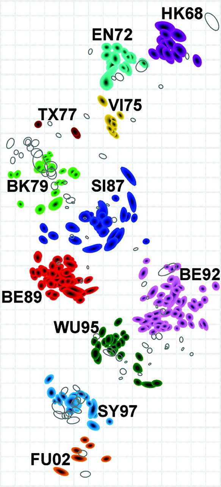
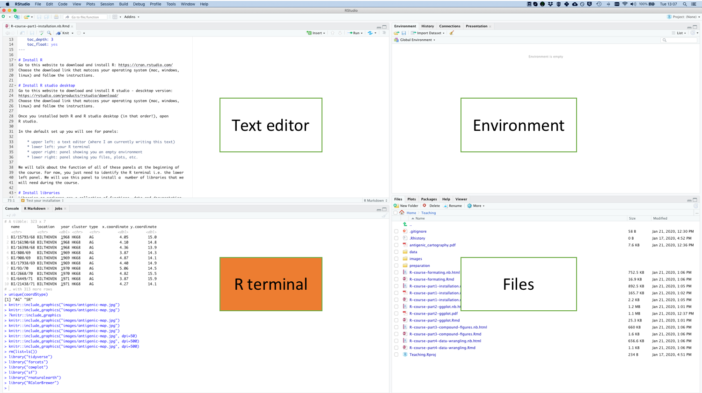
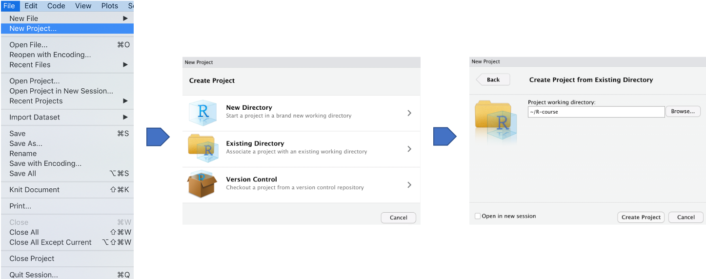
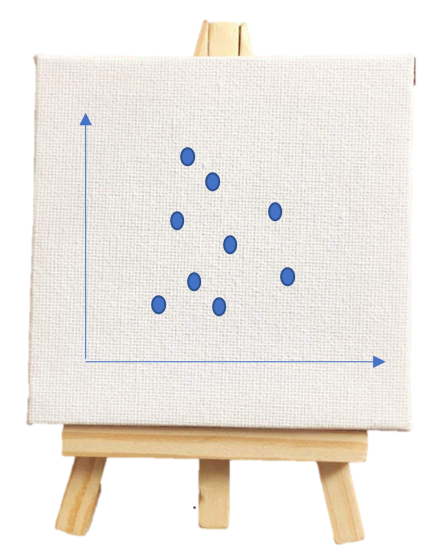
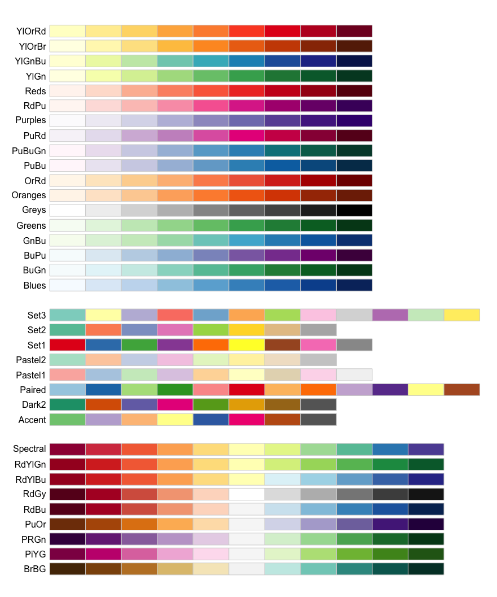

```{r setup, include=FALSE}
knitr::opts_chunk$set(echo = TRUE,
                      cache = TRUE,
                      fig.align = "center",
                      out.height = "80%",
                      tidy.opts=list(width.cutoff=60),tidy=TRUE)
```

# Background: Antigenic cartography

```{r, echo=FALSE}

```


# Getting started with Rstudio

```{r, echo=FALSE}

```


# Starting an Rproject for your analysis

* in R studio click *File > New Project*.
* choose *Existing directory*
* click on *Browse* to find the folder that
you created with the course material
* click *Create Project*

```{r, echo=FALSE}

```


# Starting of with a clean slate

* on **Mac OS**:
    * go to *RStudio > Preferences*
    * in *General* untick *restore .RData into workspace at startup*. 


* on **windows** and **linux**:
    * go to *Rstudio > Tools*
    * in *global options* untick *restore .RData into workspace at startup*.

```{r, echo=FALSE}

```


# Loading libraries

```{r}
library("tidyverse")
library("sf")
library("rnaturalearth")
library("RColorBrewer")
```

# A primer to R functions

```{r, eval=FALSE}
function_output <- function(argument1=something, argument2=something_else)
```

|                       |                                       |
|-------------------	|--------------------------------------	|
| `function_output` 	| what the function returns            	|
| `<-`              	| the assignment operator              	|
| `function`        	| name of the function                 	|
| `argument1`       	| first argument the function accepts  	|
| `something`       	| our specification to argument1       	|
| `argument2`       	| second argument the function accepts 	|
| `something_else`  	| our specification to argument2       	|

```{r, eval=FALSE}
coord <- read_csv(file = "data/2004_Science_Smith_data.csv")
```

|                       |                                       |
|-------------------	|--------------------------------------	|
| `function_output` 	| `coord`           	                |
| `<-`              	| the assignment operator           	|
| `function`        	| `read_csv`                 	        |
| `argument1`   	    | `file`                             	|
| `something`       	| "data/2004_Science_Smith_data.csv"    |

# Reading your data

Data from Smith *et al* (2004): [http://www.antigenic-cartography.org/)](http://www.antigenic-cartography.org/)

```{r}
coord <- read_csv("data/2004_Science_Smith_data.csv")
```

# Exercises

1. Use the help function`?` to have a look at the documentation of `read_csv`.
2. Have a look at the `coord` object by creating a new chunk, typing `coord` and
executing the code chunk.
3. Do you find the message printed by `read_csv` represented in `coord`?

# Exercises

1. Use the help function`?` to have a look at the documentation of `read_csv`.
```{r, eval=FALSE}
?read_csv
```

    read_delim {readr}	R Documentation
    Read a delimited file (including csv & tsv) into a tibble
    
    Description
    read_csv() and read_tsv() are special cases of the general read_delim().
    They're useful for reading the most common types of flat file data, comma
    separated values and tab separated values, respectively [...]

# Exercises

2. Have a look at the `coord` object by creating a new chunk, typing `coord` and
executing the code chunk.

```{r}
coord
```

# Exercises

3. Do you find the message printed by `read_csv` represented in `coord`?

Compare the message printed by `read_csv`:

    Parsed with column specification:
    cols(
      name = col_character(),
      year = col_double(),
      cluster = col_character(),
      type = col_character(),
      x.coordinate = col_double(),
      y.coordinate = col_double(),
      location = col_character(),
      lat = col_double(),
      lng = col_double()
    )

to the column specification in `coord`
```{r, echo=FALSE}
head(coord)
```

# Data types

The most common data types in R (base R and tidyverse) are:

|        |           |                                         |
|--------|-----------|-----------------------------------------|
| `int`  | integers  | 1, 2, 3                                 |
| `dbl`  | doubles   | 1.2, 1.7, 9.0                           |
| `chr`  | character | "a", "b", "word"                        |
| `lgl`  | logical   | TRUE or FALSE                           |
| `fctr` | factors   | categorical variables with fixed values |

# Object types

1. `data.frame`
```{r, echo=FALSE}
head(as.data.frame(coord))
```

2. `tibble`
```{r, echo=FALSE}
head(coord)
```

# Exercises: 

1. Which data types are present in our dataset?
2. How many observations and variables are in our dataset?
3. What are the variables?

# Exercises: 

1. Which data types are present in our dataset?
Have a look at the third row of the ouput of:
```{r}
coord
```

# Exercises: 

2. How many observations and variables are in our dataset?
Have a look at the second row of the ouput of:
```{r}
coord
```

# Exercises: 

3. What are the variables?

|              	|   	|                                 	|
|--------------	|---	|---------------------------------	|
| name         	|   	| name of virus isolate           	|
| year         	|   	| year of isolation               	|
| cluster      	|   	| derived cluster                 	|
| type         	|   	| serum or antigen measurement    	|
| x.coordinate 	|   	| x coordinate in antigenic space 	|
| y.coordinate 	|   	| y coordinate in antigenic space 	|
| location     	|   	| location of virus measurement   	|
| lat          	|   	| latitude of location            	|
| lng          	|   	| longitude of location            	|

# A recipe for generating graphs with ggplot2

```{r}
p <- ggplot(data = coord)
```

```{r, echo=FALSE}

```

# A recipe for generating graphs with ggplot2

```{r, eval=FALSE}
p <- ggplot(data = coord)
```

```{r, echo=FALSE}

```

```{r, eval=FALSE}
p + geom_point(mapping=aes(x=x.coordinate,
                           y=y.coordinate))
```

```{r, echo=FALSE}

```

# Our first plot

```{r}
p <- ggplot(data=coord)
p + geom_point(mapping=aes(x=x.coordinate,
                           y=y.coordinate))
```

# Exercises

1. Run `ggplot(data = coord)`. What do you see?

# Exercises

1. Run `ggplot(data = coord)`. What do you see?

```{r}
ggplot(data=coord)
```

# Exercises

2. What makes this simple plot look very different from the map that we want 
  to achieve?
  
3. What other information in our data object `coord` could we use?

# Exercises

2. What makes this simple plot look very different from the map that we want 
  to achieve?
    - no color information
    - different background
    - different dimensions
    - different labels
  
3. What other information in our data object `coord` could we use?
    - cluster
    - year
    - location

# Mapping additional aesthetics

```{r}
p + geom_point(aes(x=x.coordinate,
                   y=y.coordinate,
                   color=cluster))
```

# Colorbrewer color scales

```{r, echo=FALSE}

```

# Color scales:

```{r}
p +
  geom_point(aes(x=x.coordinate,
                 y=y.coordinate,
                 color=cluster)) +
  scale_color_brewer(type="qual",
                     palette = "Set3")
```

# Shape scales

```{r, echo=FALSE}
positions <- tibble(y=rev(c(rep(1,6),rep(2,5), rep(3,5), rep(4,5), rep(5,5))),
                    x=c(rep(1:5,5),6),
                    text=0:25)
shapes <- ggplot(data=positions)
shapes + geom_point(aes(x=x,y=y),
                    shape=0:25, size=5, fill="orange", color="blue") +
  geom_text(aes(x=x,y=y+0.3,label=text), hjust=0.5, vjust=0.5) +
  theme_void()
```

# Manual aesthetics

```{r}
p +
  geom_point(aes(x=x.coordinate,
                 y=y.coordinate,
                 color=cluster),
             shape=17) +
  scale_color_brewer(type="qual",
                     palette = "Set3") 
```

# Exercises

1. Try changing the cluster aesthetic to `size` and `shape`. Does this convey
the same level of information as a color scale?
2. What other variable in our dataset would be well represented by a `shape`
scale? Add a shape aesthetic for the variable you identified.
3. Generally speaking, which type of data lends itself to shape scales, which
to size, which to color?

# Exercises

1. Try changing the cluster aesthetic to `size` and `shape`. Does this convey
the same level of information as a color scale?

```{r}
p +
  geom_point(aes(x=x.coordinate,
                 y=y.coordinate,
                 size=cluster))
```

# Exercises

1. Try changing the cluster aesthetic to `size` and `shape`. Does this convey
the same level of information as a color scale?

```{r}
p +
  geom_point(aes(x=x.coordinate,
                 y=y.coordinate,
                 shape=cluster))
```

# Exercises

2. What other variable in our dataset would be well represented by a `shape`
scale? Add a shape aesthetic for the variable you identified.

```{r}
p +
  geom_point(aes(x=x.coordinate,
                 y=y.coordinate,
                 color=cluster,
                 shape=type))
```

# Exercises

3. Generally speaking, which type of data lends itself to shape scales, which
to size, which to color?

* shape: distinct classes, moderate (up to 6) number of classes
* color:
    * distinct classes, moderate to high (up to 12) number of classes
    * continous data that is either sequential or diverging
* size:
    * continous data that is either sequential or diverging

# Exercises
4. Why does this not work?

```{r, eval=FALSE}
p +
  geom_point(aes(x=x.coordinate, 
                 y=y.coordinate,
                 color=cluster)) +
  scale_color_brewer(type="qual",
                     palette = "Set1")
```

5. Why does this code not color all points in blue?

```{r, eval=FALSE}
p +
  geom_point(aes(x=x.coordinate,
                 y=y.coordinate,
                 color="blue")) 
```
6. Advanced: Change the overall shape of points to number 24 triangles, then
color by cluster and fill by type.

# Exercises

4. Why does this not work?

```{r, eval=FALSE}
p +
  geom_point(aes(x=x.coordinate,
                 y=y.coordinate,
                 color=cluster)) +
  scale_color_brewer(type="qual",
                     palette = "Set1")
```

-> Not enough classes in palette

# Exercises

5. Why does this code not color all points in blue?

```{r, eval=FALSE}
p +
  geom_point(aes(x=x.coordinate,
                 y=y.coordinate,
                 color="blue")) 
```

-> color is inside the aesthetics mapping; if manually setting colors, move
outside of aes

```{r}
p +
  geom_point(aes(x=x.coordinate,
                 y=y.coordinate),
             color="blue") 
```

# Exercises

6. Advanced: Change the overall shape of points to number 24 triangles, then
color by cluster and fill by type.

```{r}
p +
  geom_point(aes(x=x.coordinate,
                 y=y.coordinate,
                 color=cluster,
                 fill=type),
             shape=24)
```

# Coordinate system

```{r}
p + 
  geom_point(aes(x=x.coordinate,
                 y=y.coordinate,
                 color=cluster)) +
  scale_color_brewer(type="qual",
                     palette = "Set3") +
  coord_fixed()
```

# Labels

```{r}
p + 
  geom_point(aes(x=x.coordinate,
                 y=y.coordinate,
                 color=cluster)) +
  scale_color_brewer(type="qual",
                     palette = "Set3") +
  labs(x="Dimension 1 [AU]",
       y="Dimension 2 [AU]",
       title="Antigenic cartography",
       color="Cluster") +
  coord_fixed()
```

# Themes

```{r}
p + 
  geom_point(aes(x=x.coordinate,
                 y=y.coordinate,
                 color=cluster)) +
  scale_color_brewer(type="qual",
                     palette = "Set3") +
  labs(x="Dimension 1 [AU]",
       y="Dimension 2 [AU]",
       title="Antigenic cartography",
       color="Cluster") +
  coord_fixed() +
  theme_bw()
```

# Exercises

1. What other coordinate system options exist? Hint: type `?coord_` in a new
chunk and press tab to see other options.
2. In the previous set of exercises, you added a `shape` aesthetic. Rename the
legend title for this aesthetic
3. Test different themes and see how it effects the plot, for instance use
`theme_void()`, `theme_dark()` and `theme_classic()`. Similar to Exercise 1, you
can  type `?theme_` and tab to see other possible build in themes.
4. Why does this not work? 

```{r, eval=FALSE}
p + 
  geom_point(aes(x=x.coordinate,
                 y=y.coordinate,
                 color=cluster)) +
  scale_color_brewer(type="qual",
                     palette = "Set3") +
  labs(x="Dimension 1 [AU]",
       y="Dimension 2 [AU]",
       title="Antigenic cartography",
       color="Cluster") +
  coord_fixed()
  + theme_light()
```


# Exercises

1. What other coordinate system options exist? Hint: type `?coord_` in a new
chunk and press tab to see other options.

```{r, echo=FALSE}
knitr::include_graphics("images/coordinates.png")
```

# Exercises

2. In the previous set of exercises, you added a `shape` aesthetic. Add this
aesthetic here and rename its legend title.

```{r}
p + 
  geom_point(aes(x=x.coordinate,
                 y=y.coordinate,
                 shape=type,
                 color=cluster)) +
  scale_color_brewer(type="qual",
                     palette = "Set3") +
  labs(x="Dimension 1 [AU]",
       y="Dimension 2 [AU]",
       title="Antigenic cartography",
       color="Cluster",
       shape="Measurement") +
  coord_fixed() +
  theme_bw()
```

# Exercise

3. Test different themes and see how it effects the plot, for instance use
`theme_void()`, `theme_dark()` and `theme_classic()`. Similar to Exercise 1, you
can  type `?theme_` and tab to see other possible build in themes.

# Exercise

```{r}
p + 
  geom_point(aes(x=x.coordinate,
                 y=y.coordinate,
                 shape=type,
                 color=cluster)) +
  scale_color_brewer(type="qual",
                     palette = "Set3") +
  labs(x="Dimension 1 [AU]",
       y="Dimension 2 [AU]",
       title="Antigenic cartography",
       color="Cluster",
       shape="Measurement") +
  coord_fixed() +
  theme_void()
```

# Exercise

```{r}
p + 
  geom_point(aes(x=x.coordinate,
                 y=y.coordinate,
                 shape=type,
                 color=cluster)) +
  scale_color_brewer(type="qual",
                     palette = "Set3") +
  labs(x="Dimension 1 [AU]",
       y="Dimension 2 [AU]",
       title="Antigenic cartography",
       color="Cluster",
       shape="Measurement") +
  coord_fixed() +
  theme_dark()
```

# Exercise

```{r}
p + 
  geom_point(aes(x=x.coordinate,
                 y=y.coordinate,
                 shape=type,
                 color=cluster)) +
  scale_color_brewer(type="qual",
                     palette = "Set3") +
  labs(x="Dimension 1 [AU]",
       y="Dimension 2 [AU]",
       title="Antigenic cartography",
       color="Cluster",
       shape="Measurement") +
  coord_fixed() +
  theme_classic()
```


# Exercise

4. Why does this not work? 

```{r, eval=FALSE}
p + 
  geom_point(aes(x=x.coordinate,
                 y=y.coordinate,
                 color=cluster)) +
  scale_color_brewer(type="qual",
                     palette = "Set3") +
  labs(x="Dimension 1 [AU]",
       y="Dimension 2 [AU]",
       title="Antigenic cartography",
       color="Cluster") +
  coord_fixed()
  + theme_light()
```

As indicated in error message:
    
    Error: Cannot use `+.gg()` with a single argument. Did you accidentally put
    + on a new line?
    
# Saving your plots

```{r}
ggsave(filename="results/antigenic_cartography.pdf")
```

```{r}
ggsave(filename="results/antigenic_cartography.pdf", width=10, height=16,
       unit="cm")
```

**Note**: `ggsave` overwrites the previous file of that name without warning!

# Exercises

1. Save the plot as png and jpeg.
2. Change the size of the plot with width and height; what happens to figure
labels and legends?

# Exercises

1. Save the plot as png and jpeg.
```{r}
ggsave(filename="results/antigenic_cartography.png", width=10, height=16,
       unit="cm")

ggsave(filename="results/antigenic_cartography.jpeg", width=10, height=16,
       unit="cm")
```

# Exercises

2. Change the size of the plot with width and height; what happens to figure
labels and legends?

-> labels and legend stay legible, make sure to always choose the right 
text sizes and image sizes in combination

# Bar charts

```{r}
p + geom_bar(aes(x=year,
                 fill=cluster),
             position=position_dodge(preserve="single")) +
  scale_fill_brewer(type="qual",
                    palette = "Set3") +
  theme_bw()
```

# Histograms

```{r}
p + geom_histogram(aes(x=year,
                       fill=cluster),
             position=position_dodge(preserve="single"),
             binwidth = 10) +
  scale_fill_brewer(type="qual",
                    palette = "Set3") +
  theme_bw()
```

# Boxplots
 
```{r}
p + geom_boxplot(aes(x=type,
                     y=year,
                     color=type)) +
  geom_jitter(aes(x=type,
                  y=year,
                  color=type)) +
  theme_bw()
```

# Geographical maps

```{r}
world <- ne_countries(scale = "medium",
                      returnclass = "sf")

g <- ggplot()
g + geom_sf(data = world) +
  geom_point(data=coord,
             aes(x=lng,
                 y=lat,
                 color=cluster)) +
  scale_color_brewer(type="qual",
                     palette = "Set3")
```

# Exercises

1. Test different options for the `position` argument of `geom_bar`. Hint:
use the Details paragraph in `?geom_bar` to find a description about possible
options.
2. What happens when you choose `preserve="total"` in `position_dodge` of
`geom_histogram`? 
3. Customise the color scale and plot labels in the boxplot showing the 
distribution of measurements per type and year. What happens if you choose
`aes(fill)` instead of `aes(color)`?
4. Change `geom_jitter` to `geom_point` to see why geom_jitter is a better
visualisation of the data. Go back to using `geom_jitter` and play with the
`width` argument to customise your plot.
5. What would be a good `theme` for the world map? Add it to the plot.

# Exercises

1. Test different options for the `position` argument of `geom_bar`. Hint:
use the Details paragraph in `?geom_bar` to find a description about possible
options.

    Details

    By default, multiple bars occupying the same x position will be stacked atop
    one another by position_stack(). If you want them to be dodged side-to-side,
    use position_dodge() or position_dodge2(). Finally, position_fill() shows
    relative proportions at each x by stacking the bars and then standardising
    each bar to have the same height.
    

```{r}
p + geom_bar(aes(x=year,
                 fill=cluster),
             position=position_stack()) +
  scale_fill_brewer(type="qual",
                    palette = "Set3") +
  theme_bw()
```

# Exercises

2. What happens when you choose `preserve="total"` in `position_dodge` of
`geom_histogram`? 

**Hint**:
In the help function for `geom_histogram`, click on `position_dodge` to get to
the help for this function. From there, you can see:
    
    preserve	Should dodging preserve the total width of all elements at a
                position, or the width of a single element?
                
```{r}
p + geom_histogram(aes(x=year,
                       fill=cluster),
                   position=position_dodge(preserve="total"),
                   binwidth = 10) +
    scale_fill_brewer(type="qual",
                      palette = "Set3") +
    theme_bw()
```
# Exercises

3. Customise the color scale and plot labels in the boxplot showing the 
distribution of measurements per type and year. What happens if you choose
`aes(fill)` instead of `aes(color)`?

```{r}
p + geom_boxplot(aes(x=type,
                     y=year,
                     fill=type)) +
    geom_jitter(aes(x=type,
                    y=year,
                    color=type)) +
    scale_fill_manual(values=c("#66c2a5", "#fc8d62")) +
    labs(x="Measurement",
         y="Time",
         color="Measurement") +
    theme_bw()
```


# Exercises

4. Change `geom_jitter` to `geom_point` to see why geom_jitter is a better
visualisation of the data. Go back to using `geom_jitter` and play with the
`width` argument to customise your plot.

```{r}
p + geom_boxplot(aes(x=type,
                     y=year,
                     color=type)) +
    geom_point(aes(x=type,
                   y=year,
                   color=type)) +
    theme_bw()
```


# Exercises

5. What would be a good `theme` for the world map? Add it to the plot.
```{r}
world <- ne_countries(scale = "medium",
                      returnclass = "sf")

g <- ggplot()
g + geom_sf(data = world) +
    geom_point(data=coord,
               aes(x=lng,
                   y=lat,
                   color=cluster)) +
    scale_color_brewer(type="qual",
                       palette = "Set3") +
    theme_void()
    
```

# Additional material

* *Fundamentals of Data Visualization* at [(https://serialmentor.com/dataviz/](https://serialmentor.com/dataviz/)
@Wilke2019 (with free online version!)

* overview of the most appropriate graph for your data type at *From data to viz*
[https://www.data-to-viz.com/](https://www.data-to-viz.com/)
